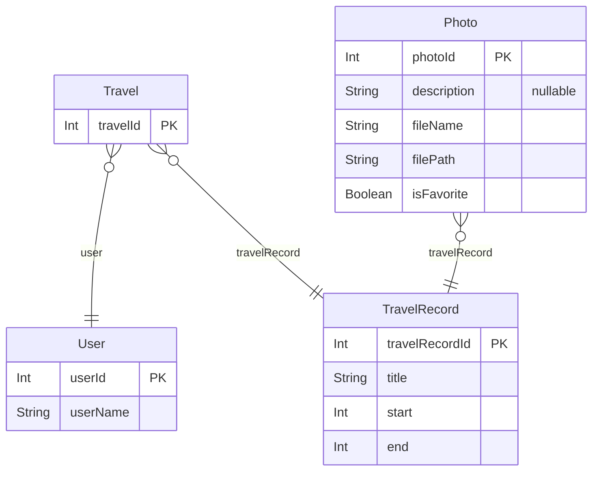

```mermaid
erDiagram

  User {
    Int userId PK
    String userName
    }


  TravelRecord {
    Int travelRecordId PK
    String title
    Int start
    Int end
    }


  Travel {
    Int travelId PK
    }


  Photo {
    Int photoId PK
    String description  "nullable"
    String fileName
    String filePath
    Boolean isFavorite
    }

    Travel o{--|| User : "user"
    Travel o{--|| TravelRecord : "travelRecord"
    Photo o{--|| TravelRecord : "travelRecord"
```
